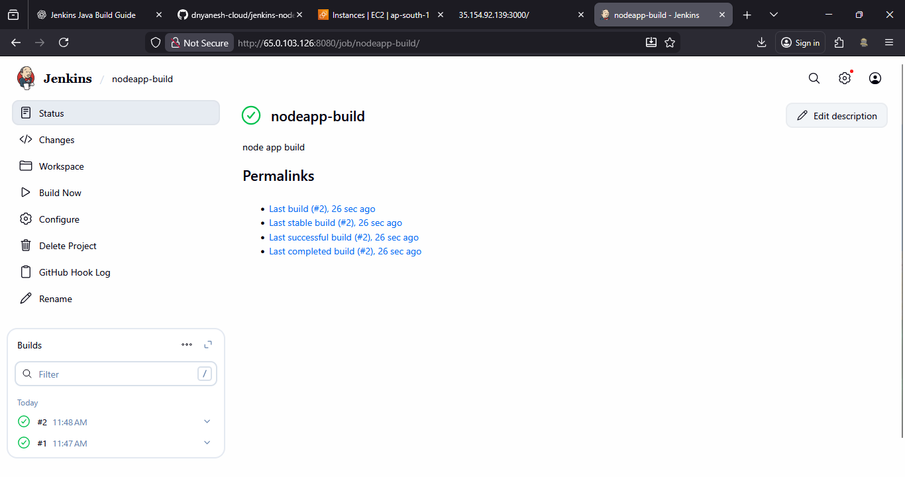
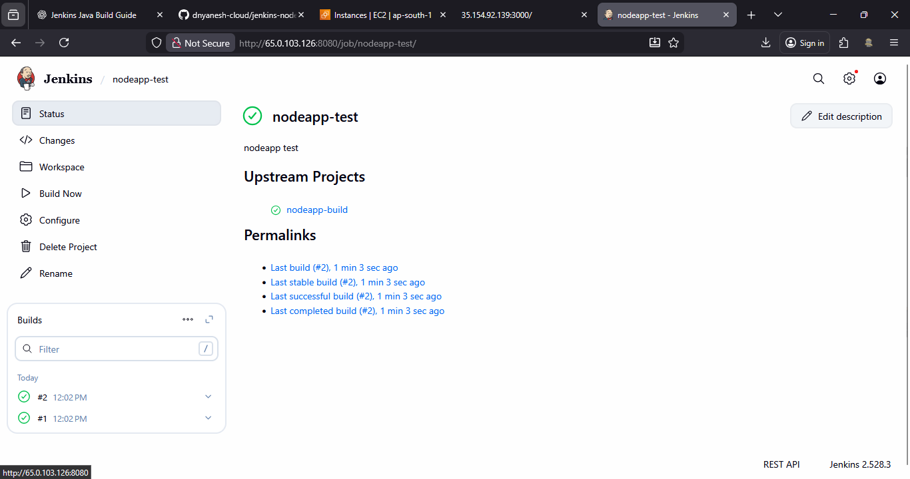
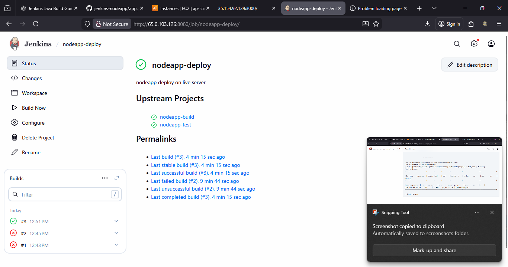
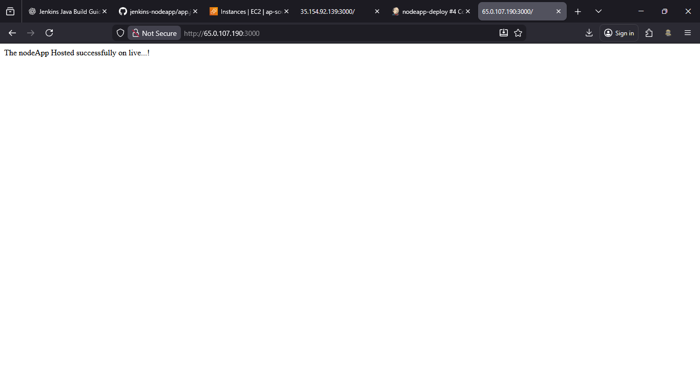

# Jenkins Project Node.js App Build – Test – Deploy (CI/CD)

### Create a complete **CI/CD pipeline for a Node.js application using Jenkins**.
---

## Architecture Overview
**Flow:**
### GitHub Push → Jenkins Build Job → Jenkins Test Job → Jenkins Deploy Job → Live Server (Port 3000)
---

## Prerequisites
* AWS EC2 instances:
  * **Development Server** (for initial Node.js app setup)
  * **Jenkins Server**
  * **Live / Deployment Server**
  
* Security Group:
  * Allow **SSH (22)**
  * Allow **Node App Port (3000)**
* GitHub account
* Jenkins installed and running

---
## Step 1: Setup Node.js Application on Development Server
### 1.1 Update System & Install Node.js
```bash
sudo apt update -y
sudo apt install nodejs -y
sudo apt install npm -y
```
### 1.2 Create Application Directory
```bash
mkdir nodeapp
cd nodeapp/
```
### 1.3 Create Application Files
**package.json**
```bash
nano package.json
```
**app.js**
```bash
nano app.js
```
> App should listen on **port 3000**
### 1.4 Install Dependencies & Run App
```bash
npm install
sudo npm install -g pm2
pm2 start app.js
```
### 1.5 Verify Application
Open browser:
```
http://<DEV-SERVER-IP>:3000
```

---
## Step 2: Push Node.js App to GitHub
```bash
git init
git add app.js package.json
git commit -m "Initial Node.js app"
git branch -M master
git remote add origin <GITHUB-REPO-URL>
git push origin master
```

---

## Step 3: Configure GitHub Webhook
* Go to **GitHub Repository → Settings → Webhooks**
* Payload URL:

  ```
  http://<JENKINS-IP>:8080/github-webhook/
  ```
---

## Step 4: Install NodeJS Plugin in Jenkins
1. Jenkins Dashboard → **Manage Jenkins**
2. Plugins → Available Plugins
3. Search **NodeJS Plugin** → Install
4. Restart Jenkins

---

## Step 5: Configure NodeJS Tool in Jenkins
1. Manage Jenkins → Tools
2. NodeJS Installation:

   * Name: `mynode`
   * Version: (System or Developer preferred)
3. Save
---

## Step 6: Jenkins Job 1 – Node.js Build Job
### Job Details
* **Job Name:** `nodeapp-build`
* Type: Freestyle Project

### Configuration
* Source Code Management:
  * Git Repository URL
* Build Triggers:
  * GitHub hook trigger for SCM polling
* Build Environment:
  * Provide Node & npm → `mynode`
* Build Step → Execute Shell:
```bash
npm install
```
* Save

---

## Step 7: Setup Testing (Mocha)
### 7.1 Create Test File
```bash
mkdir -p test
nano test/test.js
```
> Ensure **mocha** is mentioned in `package.json`

### 7.2 Push Test Files to GitHub
```bash
git add test/test.js
git commit -m "Test file created"
git push origin master
```
---

## Step 8: Jenkins Job 2 – Node.js Test Job

### Job Details
* **Job Name:** `nodeapp-test`
* Type: Freestyle Project

### Configuration
* Source Code Management:
  * Git Repository URL
* Build Trigger:
  * Build after other projects are built
  * Triggered by: `nodeapp-build`
* Build Environment:
  * Provide Node & npm
* Build Step → Execute Shell:
```bash
./node_modules/mocha/bin/_mocha --exit ./test/test.js
```
* Save
  

---

## Step 9: Prepare Live Server for Deployment
* Launch EC2 instance
* Allow **port 3000** in Security Group
---

## Step 10: Add SSH Credentials in Jenkins
1. Manage Jenkins → Credentials
2. Global → Add Credentials

**Details:**

* Kind: SSH Username with private key
* Username: `ubuntu`
* ID: `ssh-credentials-for-live-server`
* Private Key: Paste contents of `key.pem`

Save

---

## Step 11: Install SSH Build Wrapper Plugin
1. Manage Jenkins → Plugins
2. Search: `ssh-build-wrapper`
3. Install & Restart Jenkins

---
## Step 12: Configure SSH Remote Host
1. Manage Jenkins → System
2. SSH Remote Hosts:
   * Hostname: `<LIVE-SERVER-IP>`
   * Port: `22`
   * Credentials: `ubuntu`
Save

---
## Step 13: Jenkins Job 3 – Node.js Deploy Job
### Job Details
* **Job Name:** `nodeapp-deploy`
* Type: Freestyle Project

### Configuration
* Source Code Management:
  * Git Repository URL
* Build Trigger:
  * Build after other projects are built
  * Triggered by:
    * `nodeapp-build`
    * `nodeapp-test`

* Build Environment:
  * Provide Node & npm
* Build Step → Execute Shell on Remote Host:

```bash
sudo apt update -y
sleep 10
sudo apt install nodejs -y
sudo apt install npm -y

mkdir -p nodeapp
cd nodeapp

git init
git pull <GITHUB-REPO-URL>

npm install
sudo npm install -g pm2
pm2 start app.js || pm2 restart app.js
```

Save & Build


---

## Step 14: Verify Deployment
Open browser:
```
http://<LIVE-SERVER-IP>:3000
```


---

## Final CI/CD Pipeline Summary

* GitHub → Source Control
* Jenkins → Build, Test, Deploy Automation
* Mocha → Testing
* PM2 → Process Management
* Node.js → Application Runtime

✅ Fully automated Node.js CI/CD pipeline using Jenkins
